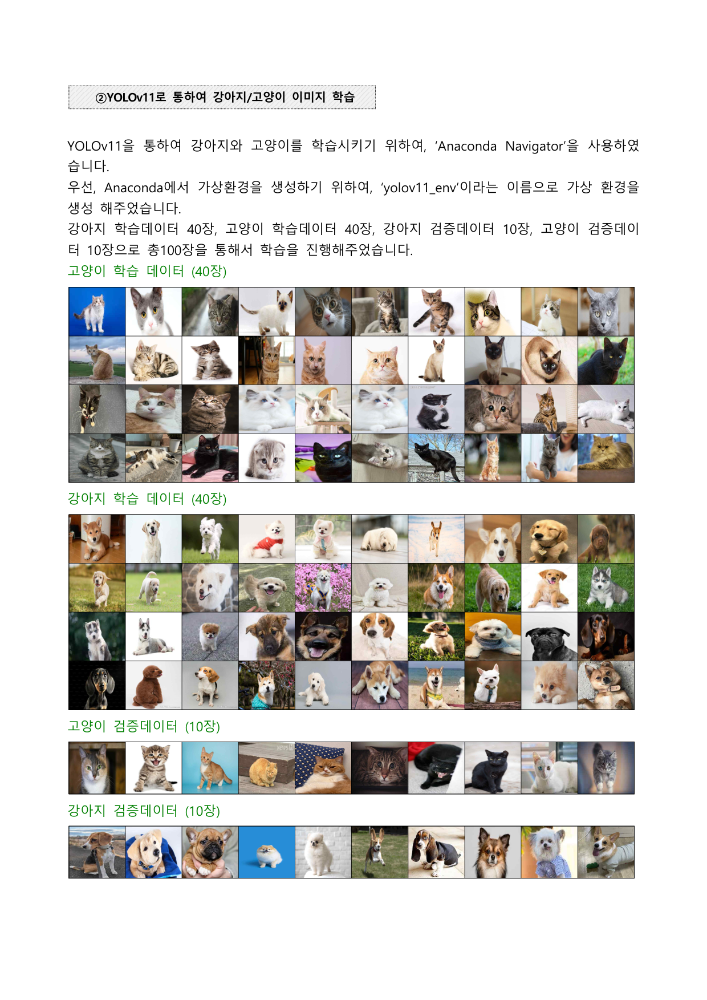
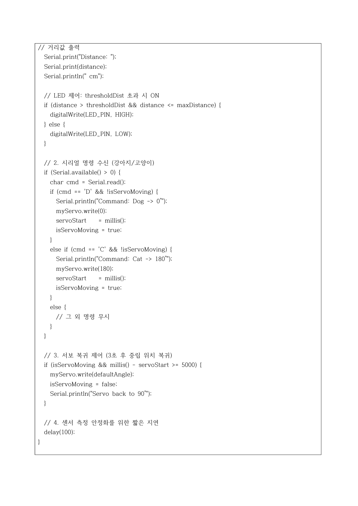
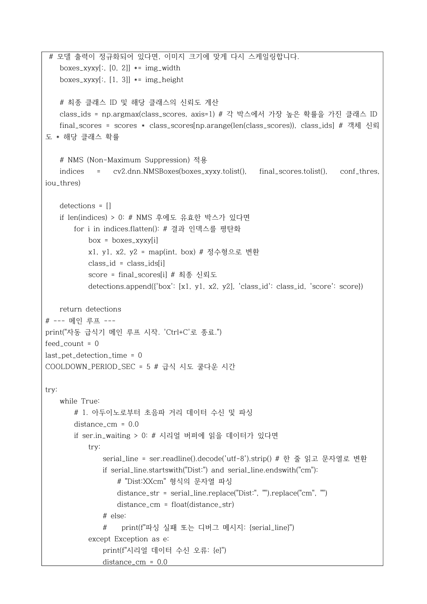
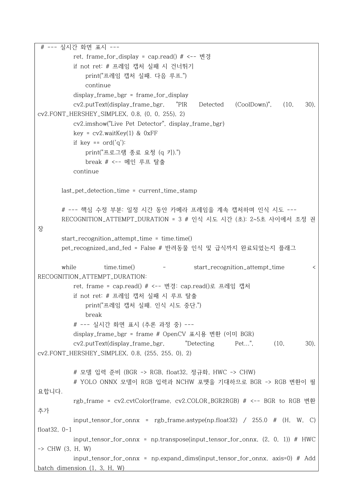
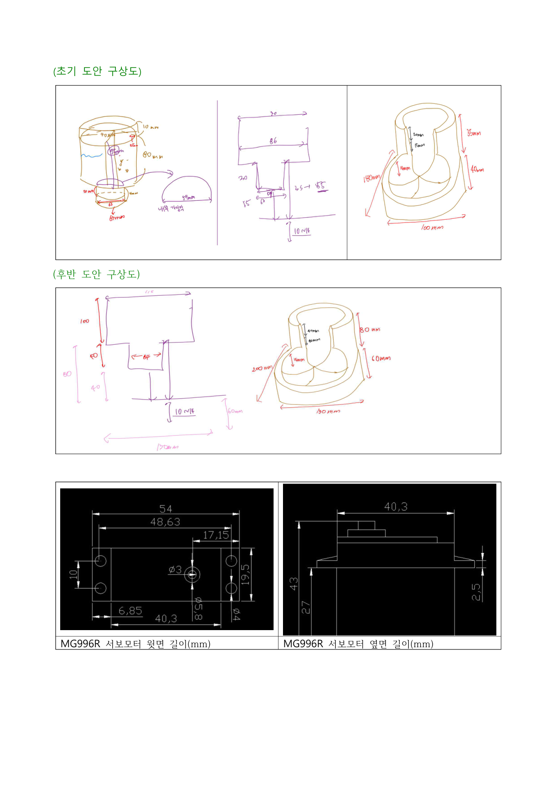
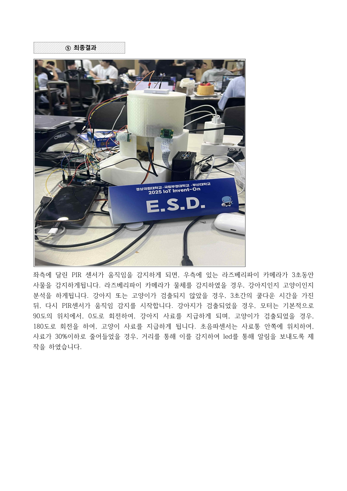
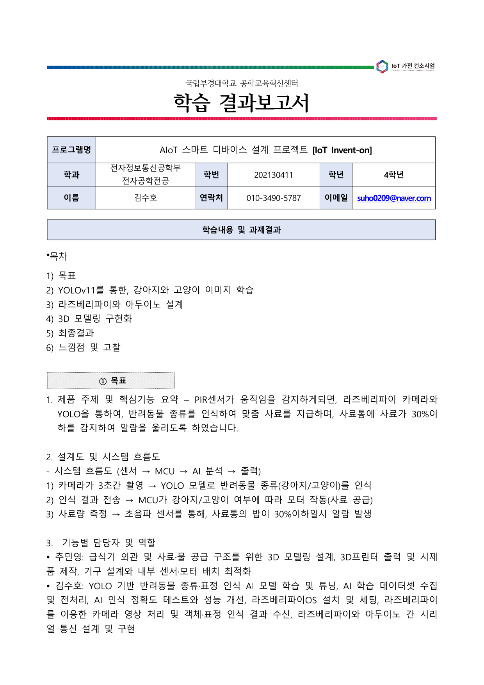

# AIoT 반려동물 자동 급식기

IoT Invent-on 경진대회(2025.06 ~ 2025.07)에서 제작한 프로젝트입니다.
PIR 센서가 움직임을 감지하면 카메라가 반려동물을 촬영하고, YOLOv11으로 강아지/고양이를 인식해서 맞춤 사료를 자동으로 지급하는 IoT 급식기입니다.

**2025.08.12 장려상 수상** (부경대학교 공학교육혁신센터)

---

### 팀 구성 및 역할

- 2인 팀 (원래 3인이었으나 1명 중도 불참)
- 본인 담당: AI 모델 학습/튜닝, 라즈베리파이-아두이노 UART 통신 설계, 하드웨어 통합
- 팀원 담당: 3D 모델링(Onshape) 및 3D프린터 출력, 센서/모터 배치

### 사용 기술

YOLOv11, Raspberry Pi 4, Arduino Uno, ONNX Runtime, UART 시리얼 통신, MG996R 서보모터, PIR 센서, 초음파 센서, Onshape 3D 모델링

---

### 시스템 동작 흐름

1. PIR 센서가 움직임 감지 → 카메라 활성화
2. 라즈베리파이 카메라가 3초간 촬영
3. YOLOv11 ONNX 모델로 강아지/고양이 인식
4. 인식 결과를 UART 통신으로 아두이노에 전송
5. MG996R 서보모터가 해당 사료통 방향으로 회전
6. 초음파 센서로 사료량 30% 이하 감지 시 LED 알림

### 프로젝트 사진

#### 시스템 구성도


#### 시스템 흐름도


#### YOLOv11 학습 데이터 (강아지 40장 + 고양이 40장 + 검증 각 10장 = 총 100장)


#### Labelimg 라벨링


#### 학습 결과 (Confusion Matrix, 100 epoch, 640x640, batch 16)


#### 하드웨어 통합 배선


#### 최종 완성품 (3D 프린팅)


#### 프로젝트 개요


---

### 문제 상황과 해결

**1. 팀원 불참**
3인 팀에서 1명이 중도 불참해서 AI 학습 + 하드웨어 통합 + 3D 모델링을 2인으로 해야 했습니다. 우선순위를 재설정해서 핵심 파이프라인(센서 → 카메라 → YOLO → UART → 서보모터)부터 3일간 밤새워 완성했습니다.

**2. UART 통신 장애**
라즈베리파이(3.3V)와 아두이노(5V) 간 전압 차이로 시리얼 통신이 깨졌습니다. 10kΩ 저항 2개로 전압 분배 회로를 구성해서 해결했습니다.

**3. 서보모터 토크 부족**
SG90(1.8kg·cm)으로는 사료 배출 구조물이 안 움직여서, MG996R(11kg·cm)로 교체했습니다.

---

### 핵심 코드

#### Arduino - 서보모터 제어

```cpp
if (Serial.available() > 0) {
  char cmd = Serial.read();
  if (cmd == 'D' && !isServoMoving) {
    Serial.println("Command: Dog -> 0°");
    myServo.write(0);      // 강아지 사료 방향
    servoStart = millis();
    isServoMoving = true;
  } else if (cmd == 'C' && !isServoMoving) {
    Serial.println("Command: Cat -> 180°");
    myServo.write(180);    // 고양이 사료 방향
    servoStart = millis();
    isServoMoving = true;
  }
}
```

#### Python - YOLO 추론 → 아두이노 명령 전송

```python
onnx_outputs = session.run(output_names, {input_name: input_tensor})

detections = postprocess_yolo_output(
    onnx_outputs, 640, 640, CONF_THRESHOLD, NMS_THRESHOLD)

for det in detections:
    if det['class_id'] == DOG_CLASS_ID:
        ser.write(b'D')  # 강아지 → 서보 0°
    elif det['class_id'] == CAT_CLASS_ID:
        ser.write(b'C')  # 고양이 → 서보 180°
```

#### YOLO 학습 스크립트

```python
from ultralytics import YOLO

model = YOLO('yolov11n.pt')
results = model.train(
    data='pet_dataset/dataset.yaml',
    epochs=100, imgsz=640, batch=16,
    name='custom_pet_yolov11'
)
```

---

### 결과

- IoT Invent-on 경진대회 장려상 수상 (2025.08.12)
- 10kΩ 전압 분배 회로로 UART 통신 안정화
- 팀원 부재 상황에서 우선순위 재설정으로 완성도 높은 결과물 도출

[← 메인으로](../README.md)
