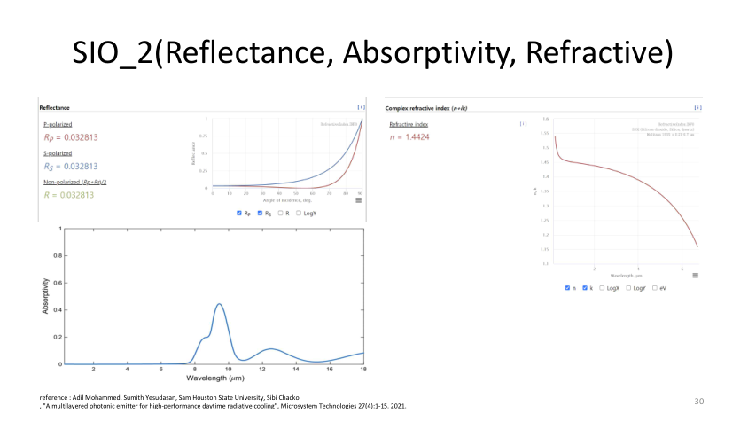
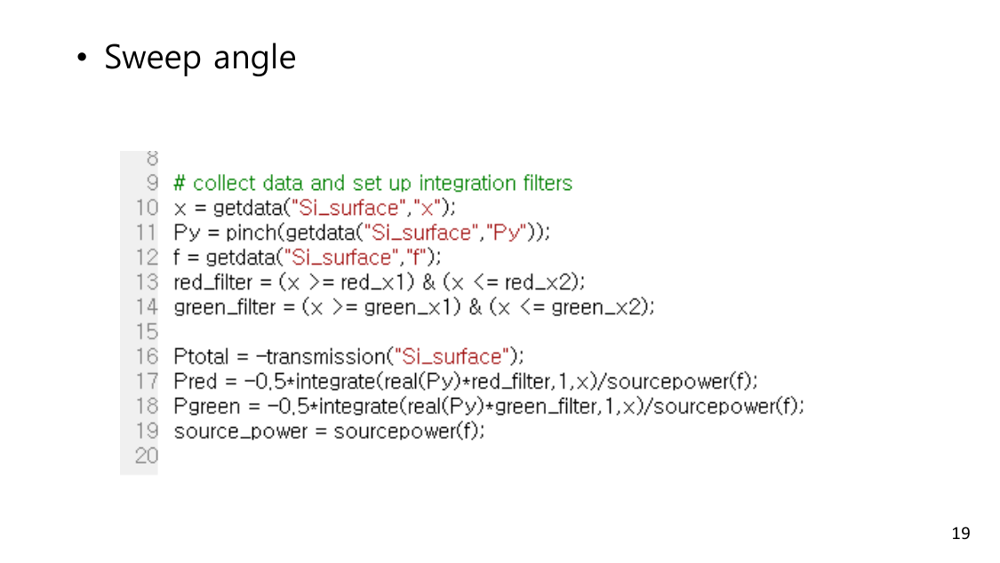
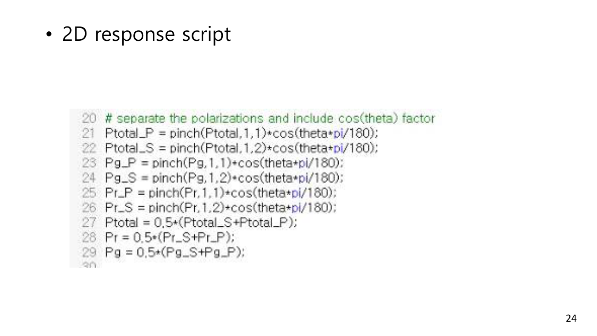
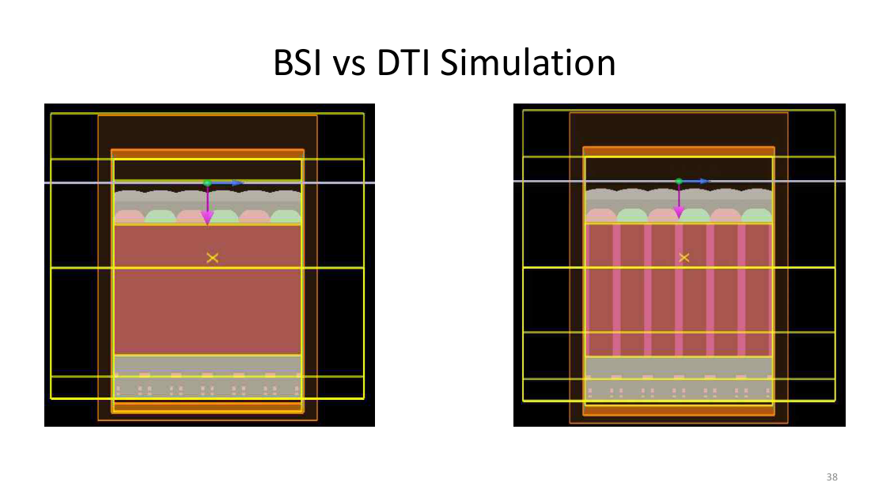
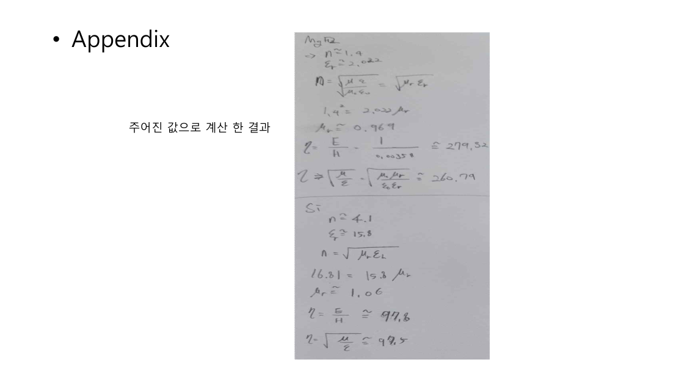
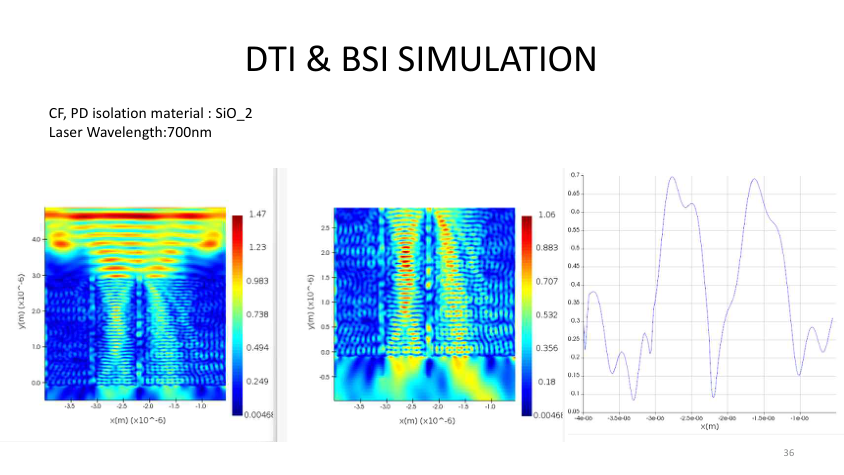

# CMOS 이미지센서 DTI 구조 최적화 시뮬레이션

캡스톤 디자인 프로젝트(2023.09 ~ 2024.06)로, Ansys Lumerical FDTD를 활용하여 CMOS 이미지센서의 DTI(Deep Trench Isolation) 구조를 최적화하고 광효율(QE)을 13.6% 향상시킨 연구입니다.

**2024.07.04 캡스톤디자인 경진대회 장려상 수상** (부경대학교 정보융합대학장)

---

### 역할

FDTD 시뮬레이션 설계, DTI 구조 모델링, 데이터 수집/분석, Semicon Korea 참관하여 Low-k 물질 데이터 확보

### 사용 기술

Ansys Lumerical FDTD, BSI(Back-Side Illumination) CMOS Image Sensor, DTI, ARC(Anti-Reflection Coating)

---

### 연구 배경

CMOS 이미지센서(CIS) 픽셀 미세화가 진행되면서 인접 픽셀 간 빛이 새는 Crosstalk 문제가 심해지고 있습니다. DTI 구조의 소재와 두께를 바꿔가며 FDTD 시뮬레이션을 반복 수행하여 최적 구조를 찾았습니다.

---

### 프로젝트 사진

#### FDTD 시뮬레이션 셋업

#### 픽셀 구조 단면도

#### DTI 구조 설계

#### E/H Field 분석 - DTI 유무에 따른 광 전파 경로 차이

#### DTI 소재별 Crosstalk 억제 효과 비교 (SiO₂, HfO₂, BlackDiamond)

#### ARC Single/Double Layer 두께 최적화

#### 최종 QE 향상 결과: 0.374 → 0.425 (+13.6%)

---

### 문제 상황과 해결

**1. Low-k 물질 데이터 부족**
DTI 소재로 유망한 BlackDiamond(Low-k) 물질의 광학 특성 데이터가 논문에 없었습니다. Semicon Korea 전시회에 직접 참관하여 Applied Materials 부스에서 굴절률(n), 소광계수(k) 데이터를 현장에서 확보했습니다.

**2. DTI 소재별 비교**
SiO₂(n=1.46), HfO₂(n=2.10), BlackDiamond(n≈1.30) 세 가지 소재로 FDTD 시뮬레이션을 반복 수행하여 E/H Field 분포를 분석했습니다. Low-k 소재가 전반사 효과를 극대화하여 Crosstalk를 가장 효과적으로 억제하는 것을 확인했습니다.

**3. ARC 두께 최적화**
Single Layer와 Double Layer ARC의 최적 두께를 파장 550nm 기준으로 계산하고 시뮬레이션으로 검증했습니다.

---

### 결과

- QE 0.374 → 0.425 (13.6% 향상)
- 캡스톤디자인 경진대회 장려상 수상 (2024.07.04)
- Semicon Korea에서 논문에 없는 Low-k 물질 데이터 직접 확보
- SiO₂, HfO₂, BlackDiamond 3종 DTI 소재 E/H Field 비교 분석 완료

[← 메인으로](../README.md)
