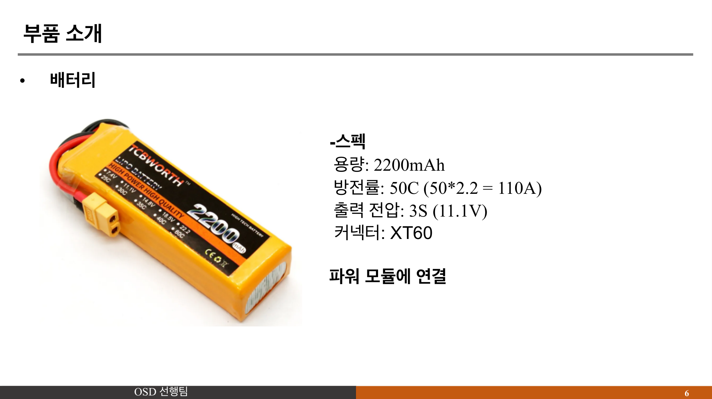
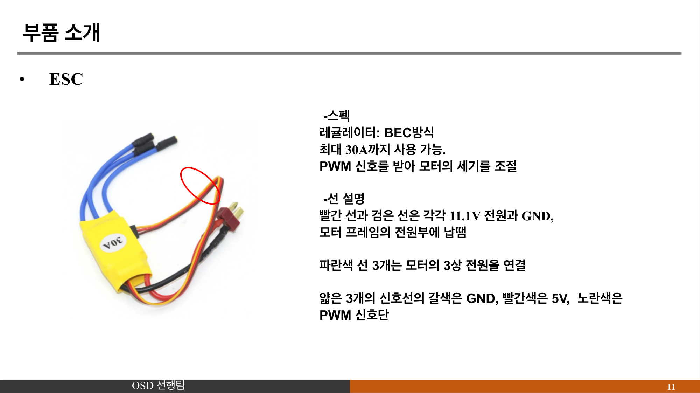
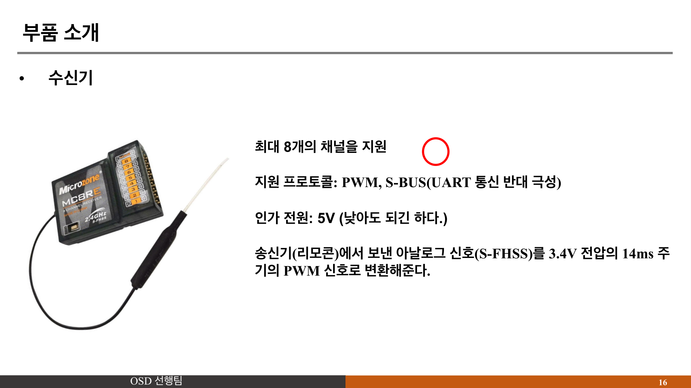
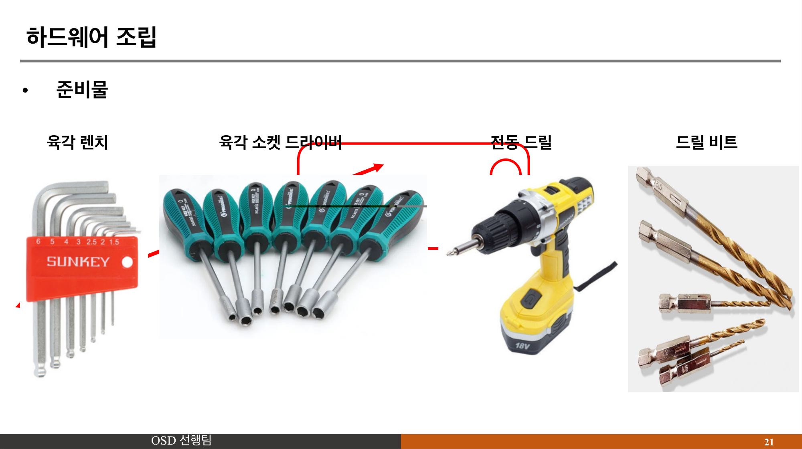
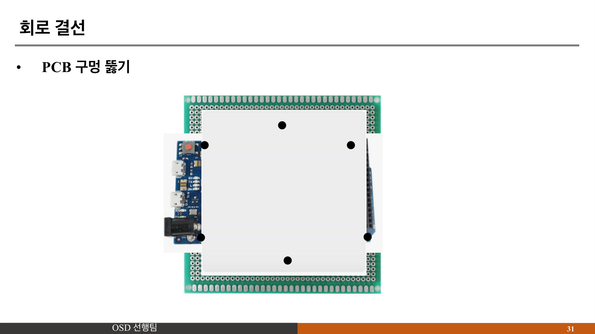
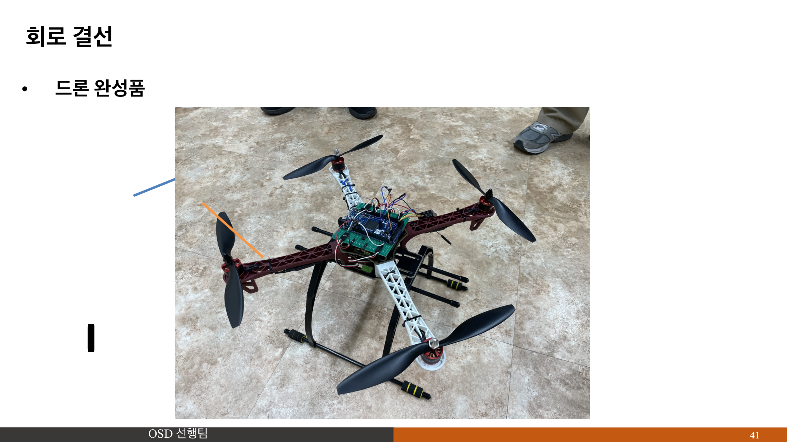

# F450 쿼드콥터 드론 제작

부경대학교 학술동아리 OSD(2023.05 ~ 2024.02)에서 F450 프레임 기반 쿼드콥터 드론을 직접 설계하고 제작했습니다.
모터가 비정상적으로 동작하는 문제를 오실로스코프로 파형 분석해서 GND 루프가 원인임을 밝혀내고, 접지 재설계 + 납땜으로 해결하여 안정 비행을 달성한 프로젝트입니다.

---

### 역할

조원, 하드웨어 제작 보조 및 PID 제어 담당

### 사용 기술

F450 프레임, Arduino, MPU6050(6축 자이로/가속도 센서), PID 제어, BLDC 모터, ESC, 오실로스코프, 납땜

---

### 프로젝트 사진

#### 드론 설계 구조


#### 회로 배선도


#### 배선 작업


#### 드론 완성품


#### PID 제어 구조 (Outer P + Inner PID 이중 루프)


#### 비행 테스트


---

### 문제 상황과 해결

조립 완료 후 모터가 비정상적으로 동작했습니다. 특정 모터만 간헐적으로 출력이 떨어지고, PWM 신호를 정상적으로 보내도 모터 반응이 불안정했습니다.

**1. 오실로스코프 파형 분석**
PWM 신호 라인과 전원 라인의 파형을 오실로스코프로 동시에 측정했습니다. 전원 라인에서 모터 동작 시에만 나타나는 비정상 노이즈 패턴을 발견했습니다.

**2. GND 루프 진단**
여러 ESC의 GND가 서로 다른 경로로 배터리에 연결되면서 접지 전위차가 발생하고, 이게 PWM 신호에 노이즈로 작용해서 모터가 오동작하는 것이었습니다.

**3. 접지 재설계**
모든 ESC의 GND를 단일 접지점(Star Ground) 방식으로 재배선하고 새로 납땜했습니다. 수정 후 오실로스코프로 노이즈 소멸을 확인했습니다.

**4. PID 파라미터 튜닝**
MPU6050 자이로 데이터 기반으로 Outer P Control(각도) + Inner PID Control(각속도) 이중 루프 구조의 PID 파라미터를 조정하여 안정적 호버링을 달성했습니다.

---

### 핵심 코드 - MPU6050 기반 PID 자세 제어

```cpp
// Outer P control (각도 제어)
Pitch_Err = mPitch - PID_Pitch_Setpoint;
Roll_Err  = mRoll  - PID_Roll_Setpoint;
Pitch_P = Pitch_Err * P_Gain;
Roll_P  = Roll_Err  * P_Gain;

// Inner PID control (각속도 제어)
Pitch_Rate_Err = Pitch_P + Gyro_Pitch_Input;
Roll_Rate_Err  = Roll_P  + Gyro_Roll_Input;

// 모터 속도 = 스로틀 + PID 출력 (X 배열)
nMotorSpeed01 = nThrottle + (Pitch_Rate_PID + Roll_Rate_PID);
nMotorSpeed02 = nThrottle + (-Pitch_Rate_PID + Roll_Rate_PID);
nMotorSpeed03 = nThrottle + (-Pitch_Rate_PID - Roll_Rate_PID);
nMotorSpeed04 = nThrottle + (Pitch_Rate_PID - Roll_Rate_PID);
```

---

### 결과

- GND 루프 해결 후 안정적 호버링 및 비행 달성
- 오실로스코프 파형 분석으로 하드웨어 문제의 근본 원인 규명
- "감이 아닌 측정 데이터로 문제를 진단한다"는 원칙을 체득

[← 메인으로](../README.md)
