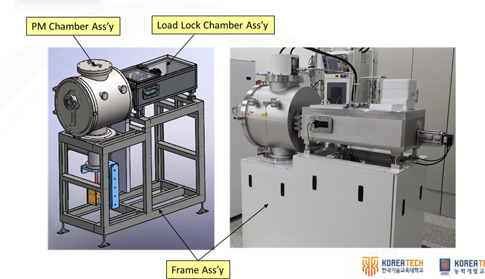
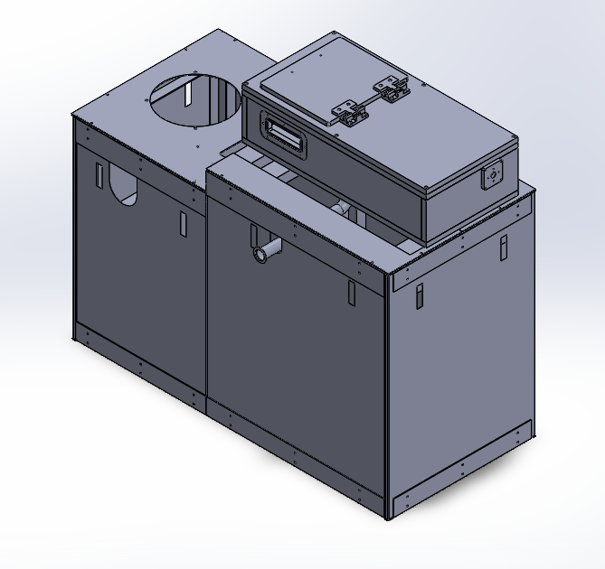
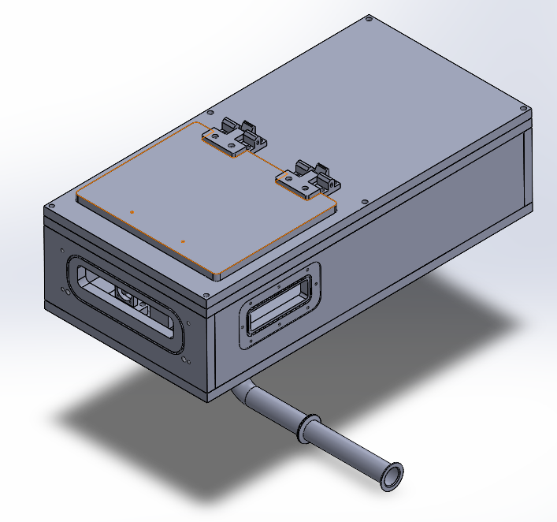
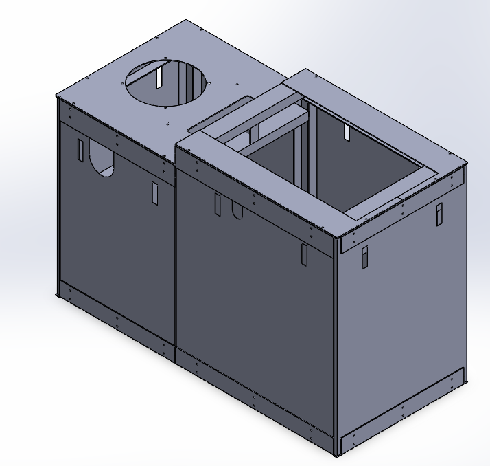
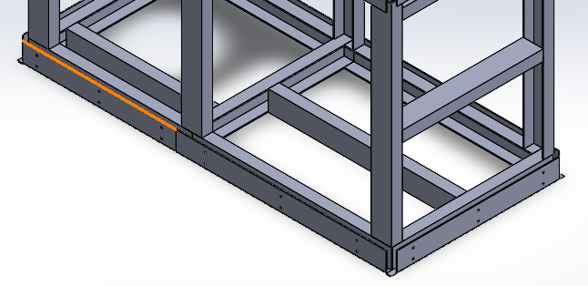
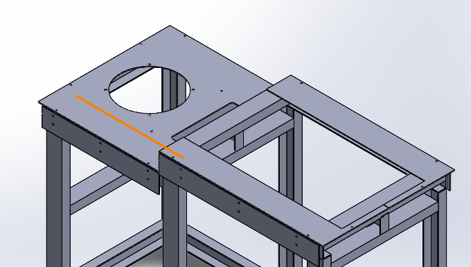
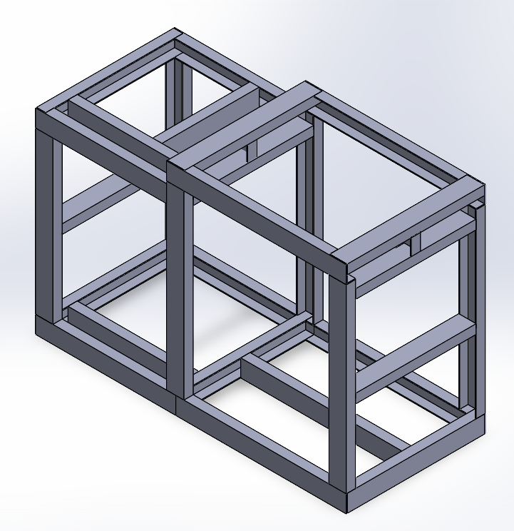

# PECVD 반도체 장비 3D 설계 (SolidWorks)

한국 폴리텍대학교 하이테크과정(반도체융합기계과)에서 실제 PECVD 장비의 2D 도면을 해독하고, SolidWorks로 전체 장비를 3D 모델링하여 조립(Assembly)까지 완성한 프로젝트입니다.

**교육 과정:** 한국 폴리텍대학교 하이테크과정 - SolidWorks 도면 설계 (2026.03 ~ )

---

### PECVD 장비란?

PECVD(Plasma-Enhanced Chemical Vapor Deposition)는 반도체 제조 공정에서 **절연막(SiO₂, SiNx), 패시베이션막** 등을 웨이퍼 위에 증착하는 장비입니다.

- **원리:** 반응 가스(SiH₄, N₂O, NH₃ 등)를 진공 챔버 내에 주입한 뒤, RF 플라즈마를 인가하여 저온(200~400°C)에서 화학 반응을 촉진시켜 박막을 증착합니다.
- **특징:** 일반 CVD 대비 낮은 온도에서 증착이 가능하여, 금속 배선이 형성된 후공정에서도 사용할 수 있습니다.
- **구성:** PM Chamber(공정 챔버), Load Lock Chamber(웨이퍼 출입), Transfer System(웨이퍼 이송), 진공 배기 라인, 프레임 구조물로 구성됩니다.

---

### 역할

실제 PECVD 장비의 2D 도면(부품도 + 조립도)을 해독하고, SolidWorks에서 개별 부품을 3D 모델링한 후 전체 Assembly로 조립

### 사용 기술

SolidWorks (3D 모델링, Assembly, 부품도/조립도 해독), 2D 도면 해독 (KS 기계 제도법)

---

### 프로젝트 사진

#### 3D 모델 vs 실제 장비 비교


SolidWorks로 모델링한 3D 어셈블리(좌)와 실제 PECVD 장비 사진(우). PM Chamber, Load Lock Chamber, Frame 구조가 실물과 동일하게 구현되었습니다.

#### 전체 어셈블리 (외장 커버 포함)


외장 커버(Sheet Metal)를 포함한 전체 장비의 등각 투영(Isometric) 뷰. 좌측에 PM Chamber 영역, 우측에 Load Lock Chamber 영역이 배치됩니다.

#### Load Lock Chamber Assembly


웨이퍼가 외부에서 진공 챔버로 출입하는 Load Lock Chamber. 전면에 웨이퍼 투입구(View Port) 2개가 있으며, 하단에 NW40 진공 배기 라인이 연결됩니다.

#### 프레임 + 커버 (내부 구조 노출)


외장 커버를 씌운 상태에서 상부 커버를 분리한 뷰. PM Chamber가 안착되는 우측 상단 개구부와, 진공 펌프 연결을 위한 좌측 원형 홀이 보입니다.

#### Table Frame (하부 프레임) 상세


장비 하부를 지지하는 Table Frame의 Foot Plate 상세. 레벨링을 위한 조절 볼트 구조와 프레임 용접부 마감이 모델링되어 있습니다.

#### 상부 프레임 접합부 상세


PM Chamber 영역과 Load Lock Chamber 영역을 연결하는 상부 프레임 접합부. 볼트 체결 홀과 플레이트 맞닿음(fit-up) 구조가 확인됩니다.

#### Table Frame 전체 구조


장비 전체를 지지하는 Table Frame Assembly. 각형 강관(Square Tube)으로 구성되며, PM Chamber 영역(좌)과 Load Lock Chamber 영역(우)을 별도 섹션으로 지지합니다.

---

### 설계 과정

**1. 2D 도면 해독**
실제 PECVD 장비의 부품도(Part Drawing)와 조립도(Assembly Drawing)를 KS 규격에 따라 해독했습니다. 각 부품의 치수, 공차, 표면 거칠기, 재질 정보를 파악하고 3D 모델링에 반영했습니다.

**2. 개별 부품 모델링**
11개 서브 어셈블리의 개별 부품을 SolidWorks에서 모델링했습니다:

| 서브 어셈블리 | 설명 |
|-------------|------|
| DOOR | 챔버 도어 |
| DOOR SUPPORT 상부/하부 | 도어 힌지 및 지지 구조물 |
| DRIVING SCREW ASSY | 웨이퍼 이송용 구동 스크류 |
| FR FOOT PLT ASM | 하부 프레임 레벨링 플레이트 |
| FRAME 상부 COVER | 상부 외장 커버 (Sheet Metal) |
| LID DOOR ASSY | 챔버 상부 리드 도어 |
| LOAD LOCK CHAMBER BODY ASSY | 로드락 챔버 본체 |
| NW40 PIPE 배기 LINE ASSY | 진공 배기 배관 |
| TABLE FRAME | 장비 지지 프레임 |
| TRANSFER ASSY | 웨이퍼 이송 시스템 |

**3. 전체 어셈블리 조립**
모델링된 부품들을 메이트(Mate) 조건으로 조립하여 전체 장비 어셈블리를 완성했습니다. 실제 장비 사진과 비교하여 구조적 정확성을 검증했습니다.

---

### 배운 점

- **도면 해독 능력:** 2D 도면에서 3차원 형상을 읽어내는 능력을 확보했습니다. 투상법(제3각법), 단면도, 치수 공차를 실무 수준으로 이해하게 되었습니다.
- **장비 구조 이해:** PECVD 장비의 챔버, 진공 배기, 웨이퍼 이송, 프레임 구조를 부품 단위로 파악할 수 있게 되었습니다.
- **어셈블리 설계:** 다수의 부품을 메이트 조건으로 조립하면서, 부품 간 간섭(Interference) 체크와 조립 순서를 고려한 설계를 경험했습니다.

---

### 파일 구조

```
PECVD_Equipment/
├── README.md
└── images/
    ├── pecvd_overview.png        # 3D 모델 vs 실제 장비 비교
    ├── full_assembly_iso.png     # 전체 어셈블리 (외장 커버 포함)
    ├── loadlock_chamber.png      # Load Lock Chamber
    ├── frame_cover_open.png      # 프레임 + 커버 (내부 노출)
    ├── frame_base_detail.png     # 하부 프레임 상세
    ├── frame_top_detail.png      # 상부 프레임 접합부
    └── table_frame.png           # Table Frame 전체 구조
```

[← 메인으로](../README.md)
