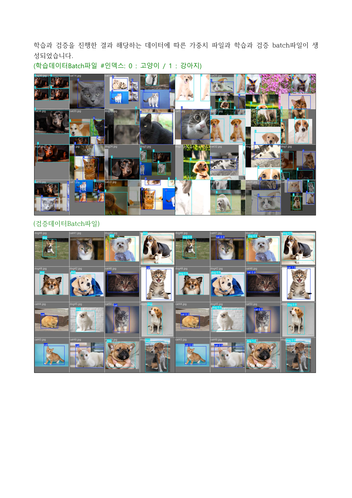
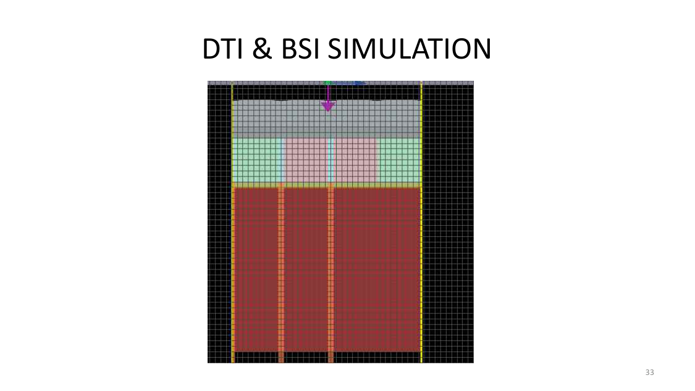

<h1 align="center">김수호 | 반도체 장비 엔지니어 포트폴리오</h1>

  <strong>측정 데이터로 문제를 해결하는 엔지니어</strong> 
  오실로스코프 파형 분석부터 FDTD 광학 시뮬레이션까지, 현장의 문제를 측정과 분석으로 해결합니다.

  
  
  
  
  
  

---

## 👤 About Me

| 항목 | 내용 |
|:---:|:---|
| **이름** | 김수호 (Kim Suho) |
| **학교** | 국립부경대학교 전자공학전공 |
| **목표 직무** | 반도체 장비 엔지니어 (Field Service Engineer) |
| **이메일** | woals001020@gmail.com |

> 반도체 8대 공정을 직접 수행하고, 오실로스코프로 드론의 GND 루프를 진단하고, FDTD 시뮬레이션으로 이미지센서 광효율을 13.6% 향상시킨 경험을 통해, **"감이 아닌 데이터로 문제를 해결하는"** 엔지니어로 성장하고 있습니다.

---

## 🛠 기술 스택

**측정 & 분석 장비**

**시뮬레이션 도구**

**프로그래밍 & 통신**

**반도체 공정**

---

## 📁 프로젝트

### 1. [AIoT 반려동물 자동 급식기](./AIoT_SmartFeeder)
> YOLOv11 기반 반려동물 인식 AI와 Raspberry Pi-Arduino UART 통신으로 맞춤 사료를 자동 지급하는 IoT 스마트 급식기 시스템

`YOLOv11` `Raspberry Pi 4` `Arduino Uno` `UART` `ONNX` `3D Printing` `MG996R`

🏆 **IoT Invent-on 경진대회 장려상 수상**

---

### 2. [F450 쿼드콥터 드론 제작](./Drone_F450)
> 오실로스코프로 GND 루프를 진단하고 납땜으로 해결한 측정 기반 트러블슈팅 프로젝트

`F450 Frame` `Arduino` `PID 제어` `오실로스코프` `MPU6050` `납땜`

---

### 3. [CMOS 이미지센서 광학 시뮬레이션](./CMOS_ImageSensor)
> Ansys Lumerical FDTD로 DTI 구조를 최적화하여 QE(광효율) 13.6% 향상을 달성한 캡스톤 디자인 연구

`Ansys Lumerical FDTD` `CMOS Image Sensor` `DTI` `ARC` `BSI` `Semicon Korea`

🏆 **캡스톤 디자인 장려상 수상**

---

### 4. [TCAD CMOS Inverter 시뮬레이션](./TCAD_CMOS_Inverter)
> TCAD Sentaurus로 CMOS Inverter 전 공정을 시뮬레이션하고, n-well 도핑 최적화로 정상 동작을 검증한 프로젝트

`TCAD Sentaurus` `CMOS Inverter` `Process Simulation` `n-well` `VTC Analysis`

---

## 🏆 수상 경력

| 연도 | 대회 | 수상 |
|:---:|:---|:---:|
| 2024 | IoT Invent-on 경진대회 (AIoT 스마트 급식기) | 장려상 |
| 2025 | 캡스톤 디자인 (CMOS 이미지센서 광학 시뮬레이션) | 장려상 |

---

## 📚 교육 이수

| 기간 | 교육기관 | 과정명 | 시간 |
|:---:|:---|:---|:---:|
| 2024 | 반도체공정기술교육원 | NMOS 8대 공정 실습 (RIE, LPCVD, 포토리소, I-V 측정) | 32h |
| 2024-2025 | 한국폴리텍대학 | 반도체장비유지보수 (진공, 가스시스템, PLC, 장비 실습) | 332h |

---

## 📫 Contact

- **Email**: woals001020@gmail.com
- **GitHub**: [github.com/woals001020](https://github.com/woals001020)
