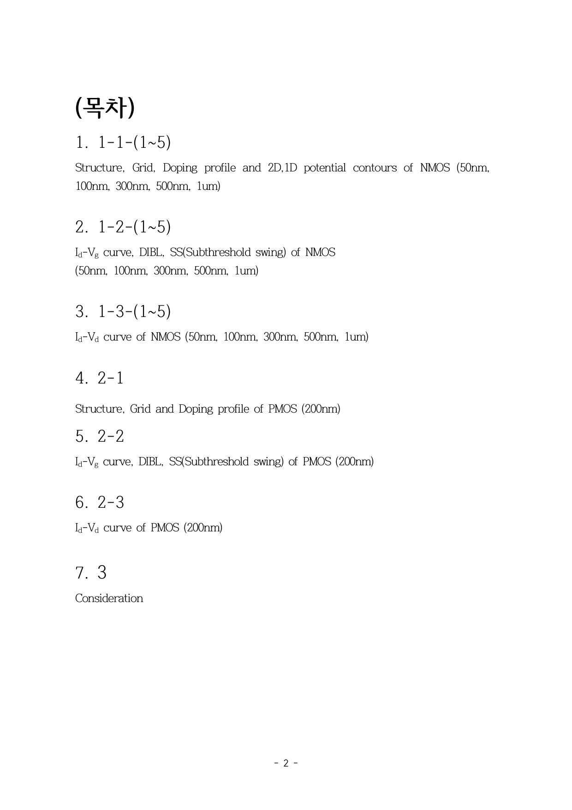
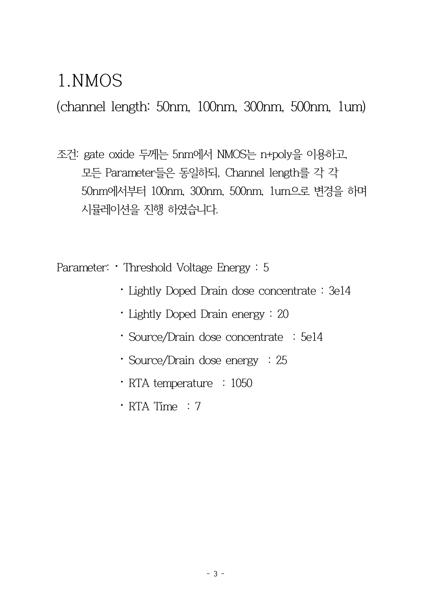
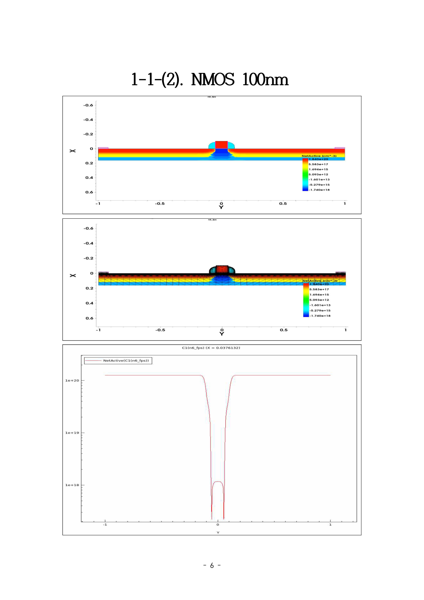
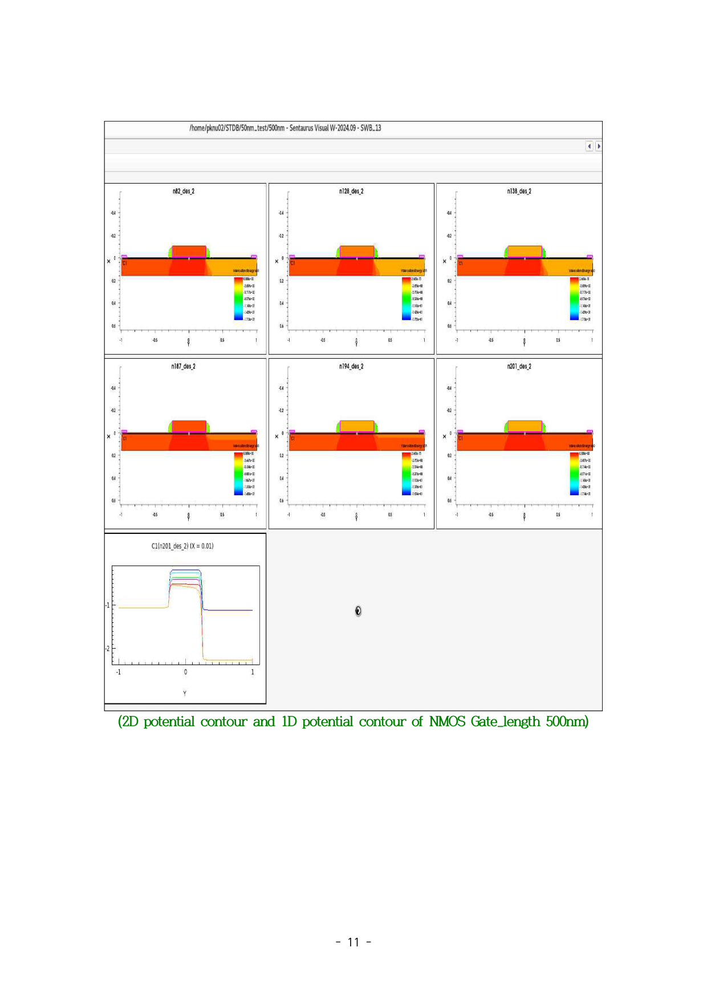
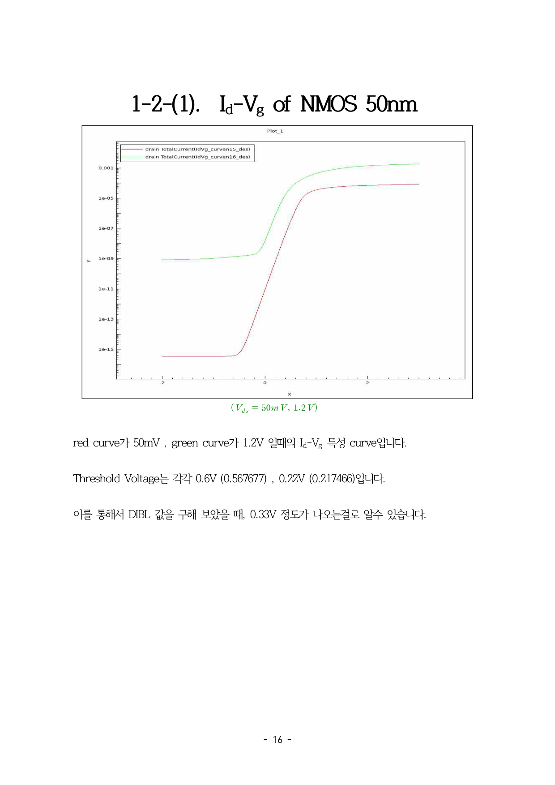
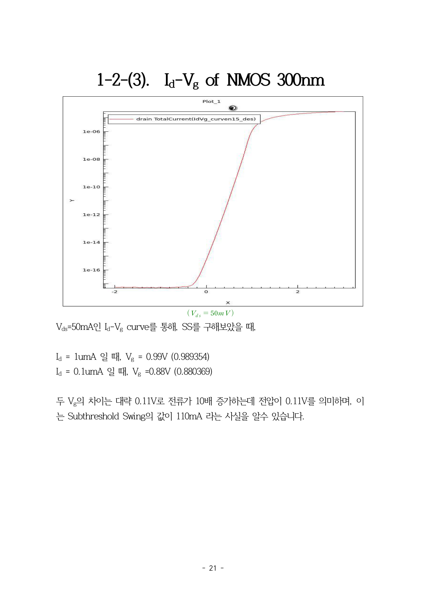
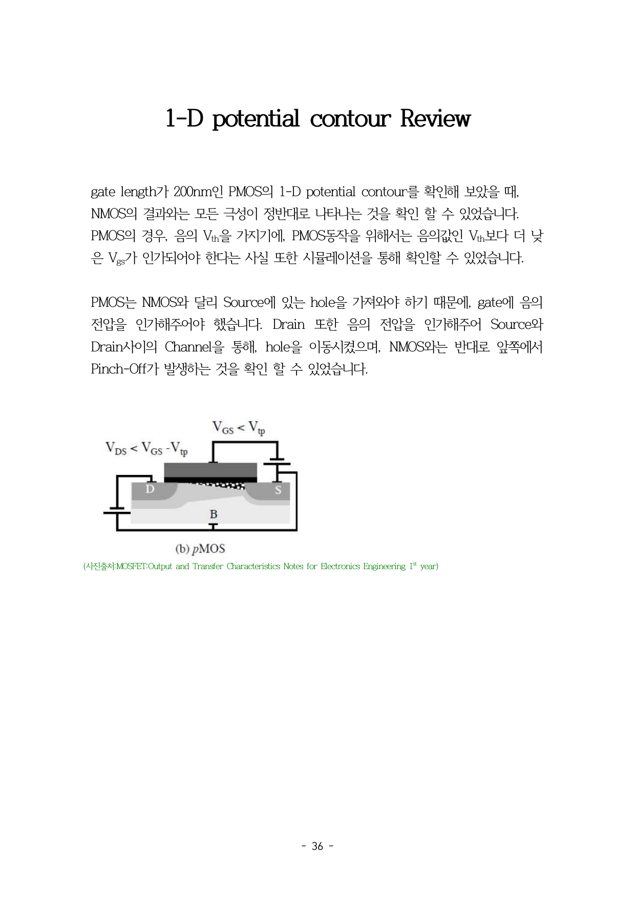

# TCAD CMOS Inverter 시뮬레이션

반도체 공정 설계 프로젝트(2025.05 ~ 2025.06)에서 TCAD Sentaurus를 이용하여 CMOS Inverter의 전 공정을 시뮬레이션했습니다.
n-well 도핑 농도를 최적화하여 NMOS/PMOS 대칭 동작과 정상적인 VTC(Voltage Transfer Characteristic)를 검증했습니다.

---

### 역할

조원, TCAD 코드 작성, 공정 시뮬레이션 설계 및 파라미터 최적화

### 사용 기술

Synopsys TCAD Sentaurus (Process + Device 시뮬레이션)

---

### 프로젝트 사진

#### TCAD 소자 단면도

#### 공정 흐름도

#### I-V 특성 그래프

#### 도핑 프로파일

#### VTC 곡선 - 전환 전압(Vm) ≈ VDD/2 대칭 동작 확인

#### 공정 파라미터 변경에 따른 소자 특성 변화

#### n-well 도핑 최적화 전후 비교

---

### 문제 상황과 해결

**1. PMOS Vth 이상**
초기 시뮬레이션에서 n-well 도핑 농도가 적절하지 않아 PMOS의 Vth가 설계 사양을 벗어났습니다.

**2. NMOS/PMOS 비대칭**
전류 구동 능력 불균형으로 Inverter의 전환 전압(Vm)이 VDD/2에서 크게 벗어났습니다.

**3. 해결**
n-well 이온주입 에너지와 도즈량을 체계적으로 조정했습니다. 최적화 후 VTC 곡선에서 Vm ≈ VDD/2를 달성하여 NMOS/PMOS 대칭 동작을 확인했습니다.

### 전 공정 시뮬레이션 순서

1. 초기 산화 - SiO₂ 보호막 형성
2. n-well 이온주입 - PMOS 영역에 n형 도핑
3. 게이트 산화 - 얇은 게이트 산화막
4. 폴리실리콘 게이트 - 게이트 전극 패터닝
5. S/D 이온주입 - NMOS(n+), PMOS(p+) source/drain
6. 금속 배선 - Al 배선 및 Contact

---

### 결과

- CMOS Inverter 정상 동작 시뮬레이션 완성
- VTC에서 전환 전압(Vm) ≈ VDD/2 달성
- 공정 파라미터(도핑 에너지, 도즈량)가 소자 특성(Vth, VTC)에 미치는 영향을 정량적으로 분석
- TCAD Sentaurus Process/Device 시뮬레이션 전 과정 수행

[← 메인으로](../README.md)
